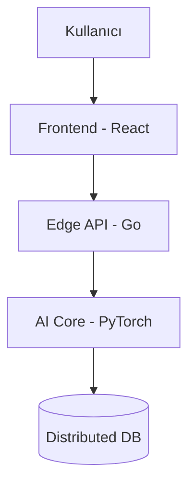

# 🚀 [PROJE ADINIZ: ELITE-DEFENSE-CORE]

<div align="center">
  
  
  
</div>

---

## 🏛️ Proje Vizyonu
Bu proje, [Projenizin temel amacı - Örn: Savunma sanayiinde otonom hava araçları için yapay zeka tabanlı koordinasyon sistemi] geliştirmek amacıyla [X] teknolojileri kullanılarak inşa edilmiştir.

## 🎯 Temel Özellikler
- **Gerçek Zamanlı Analiz:** [Detay]
- **Yüksek Ölçeklenebilirlik:** [Detay]
- **AI Destekli Karar Mekanizması:** [Detay]

## 🏗️ Mimari Şema



## 🛠️ Kurulum (Installation)
```bash
git clone https://github.com/bahattinyunus/your-project.git
cd your-project
docker-compose up -d
```

## 🧪 Testler
```bash
npm test # veya make test
```

## 📄 Lisans
Bu proje [MIT](./LICENSE) lisansı altında korunmaktadır.

---
<div align="center">
  <sub>KTÜ Yazılım Mühendisliği Bitirme Çalışması © 2025</sub>
</div>
