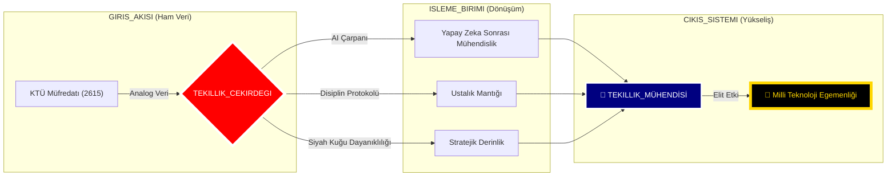

<div align="center">

# 🛰️ KTÜ YAPAY ZEKA SONRASI STRATEJİK KOMUTA MERKEZİ
## ⛩️ "Üstün Mühendislik ve Çok Boyutlu Uzmanlık" ⛩️

[](./4_SISTEM/OZET.md)
[](./1_DOKTRIN/MIMARI_YAPI.md)
[](./4_SISTEM/OZET.md)

---

### 🏛️ DEPO KADERİ (REPOSITORY DESTINY)
**Bu arşiv; sıradan bir akademik depo değildir. Bu, liyakatin dijital bir kale (Fortress) haline geldiği, müfredatın bir "Temel Katman" (Base Layer) olarak aşılıp, yapay zeka ve mühendislik disipliniyle arşa çıkarıldığı bir "Tekillik" (Singularity) merkezidir.**

[🛰️ Mimari](./1_DOKTRIN/MIMARI_YAPI.md) • [📜 Manifesto](./1_DOKTRIN/_MANIFESTO/README.md) • [📡 Yol Haritası](./3_KARIYER/YOL_HARITALARI/README.md) • [📜 Ustalık Logu](./4_SISTEM/ANA_LOG.md)

---

## 🚀 BAŞLANGIÇ VE USTALIK MERKEZİ
**Bu depo bir liyakat kalesidir; onu nasıl kullanacağınızı bilin:**

### 📖 Temel Rehberler
- **[🧠 Nasıl Çalışmalı?](./2_USTALIK/NASIL_CALISMALI.md):** Mühendislik disiplini ve öğrenme teknikleri.
- **[🏗️ Proje Rehberi](./2_USTALIK/PROJE_REHBERI.md):** Seviye bazlı, sektörel proje fikirleri.
- **[📡 Kariyer ve Ağ](./3_KARIYER/KARIYER_VE_AG.md):** Sektörde liyakatini ispatlama ve networking.
- **[🤝 Mentorluk & İş Birliği](./3_KARIYER/MENTORLUK_VE_YARDIMLASMA.md):** Kolektif gelişim ve yardımlaşma kuralları.

### 🏛️ Derinleşme Rehberleri (Instructional)
- **[📜 Programlama Doktrini](./2_USTALIK/_REHBERLER/PROGRAMLAMA_DOKTRINI.md):** Temiz kod ve yazılım felsefesi.
- **[🏗️ Sistem Tasarımı](./2_USTALIK/_REHBERLER/SISTEM_TASARIMI_EL_KITABI.md):** Mimari düşünce yapısı.
- **[🤖 AI ile Derin Öğrenme](./2_USTALIK/_REHBERLER/AI_ILE_DERIN_OGRENME.md):** Yapay zekayı öğretmen olarak kullanma.
- **[📡 Ustalık Notları (80/20)](./2_USTALIK/_USTALIK_NOTLARI/README.md):** Kritik konuların can alıcı özetleri.

---

</div>

## 📡 CANLI SİSTEM TELEMETRİSİ (GERÇEK ZAMANLI VİZYON)



---

## 🏗️ AKADEMİK KOMUTA PANELİ (TEKILLIK_MODU)

Müfredatı bir "Sistem Hackleme" operasyonu gibi yönetiyoruz. Her dönem bir "Sektördür".

<table width="100%">
  <tr>
    <th width="50%" align="center">🔥 SEKTÖR 01: ATEŞLEME (1. SINIF)</th>
    <th width="50%" align="center">🛡️ SEKTÖR 02: TAHKİMAT (2. SINIF)</th>
  </tr>
  <tr>
    <td valign="top">
      <ul>
        <li><b>SEC-01:</b> <a href="./0_MUREDDAAT/1_SINIF/1_Guz/">Algoritma ve Mantık Hackleme</a> <br/> <sub><i>"Mantıksal temeli AI ile yıkıp yeniden kur."</i></sub></li>
        <li><b>SEC-02:</b> <a href="./0_MUREDDAAT/1_SINIF/2_Bahar/">Sistem Çekirdek Keşfi</a> <br/> <sub><i>"Donanımın ruhuna (C/ASM) ilk sızma."</i></sub></li>
      </ul>
    </td>
    <td valign="top">
      <ul>
        <li><b>SEC-03:</b> <a href="./0_MUREDDAAT/2_SINIF/3_Guz/">Veri Yapıları Tekilliği</a> <br/> <sub><i>"Bellek optimizasyonunun zirvesi."</i></sub></li>
        <li><b>SEC-04:</b> <a href="./0_MUREDDAAT/2_SINIF/4_Bahar/">Mimari Sağlamlaştırma</a> <br/> <sub><i>"DB ve Sistem mimarisinin inşası."</i></sub></li>
      </ul>
    </td>
  </tr>
  <tr>
    <th width="50%" align="center">⚡ SEKTÖR 03: YÜKSELİŞ (3. SINIF)</th>
    <th width="50%" align="center">🌌 SEKTÖR 04: ÖTESİ (4. SINIF)</th>
  </tr>
  <tr>
    <td valign="top">
      <ul>
        <li><b>SEC-05:</b> <a href="./0_MUREDDAAT/3_SINIF/5_Guz/">Derin Altyapı ve Ağ Uzmanlığı</a> <br/> <sub><i>"İşletim Sistemi ve Ağ katmanlarında hakimiyet."</i></sub></li>
        <li><b>SEC-06:</b> <a href="./0_MUREDDAAT/3_SINIF/6_Bahar/">Ölçeklenebilir Tekillik Mimarisi</a> <br/> <sub><i>"Dağıtık sistemlerin tanrısı ol."</i></sub></li>
      </ul>
    </td>
    <td valign="top">
      <ul>
        <li><b>SEC-07:</b> <a href="./0_MUREDDAAT/4_SINIF/7_Guz/">Endüstriyel Kalite Kuantumu</a> <br/> <sub><i>"Kusursuz kalite ve otonom test."</i></sub></li>
        <li><b>SEC-08:</b> <a href="./0_MUREDDAAT/4_SINIF/8_Bahar/">Final: TEKILLIK_PROJESI</a> <br/> <sub><i>"Zamanın ötesindeki son mühür."</i></sub></li>
      </ul>
    </td>
  </tr>
</table>

---

## 🛣️ USTALIK YOL HARİTALARI (MASTERY ROADMAPS)

| Uzmanlık | Odak | Yol Haritası |
| :--- | :--- | :--- |
| **Sistem Mimarı** | Mimari ve Düşük Seviye | [🔍 Yolu Keşfet](./3_KARIYER/YOL_HARITALARI/SYSTEM_ARCHITECT.md) |
| **Yapay Zeka Çözüm Mühendisi** | AI ve Veri | [🔍 Yolu Keşfet](./3_KARIYER/YOL_HARITALARI/AI_ENGINEER.md) |
| **Siber Savunma Lideri** | Savunma ve Ağ | [🔍 Yolu Keşfet](./3_KARIYER/YOL_HARITALARI/CYBER_DEFENSE.md) |

---

## 🛡️ STRATEJİK DOKTRİNLER (DOKTRİNLER)

> [!CAUTION]
> ### ⚔️ KURAL 01: DİPLOMA YAN ÜRÜNDÜR
> Diploma bir gaye değil, liyakat yolculuğunda toplanan bir ganimettir. Asıl hedef, sistemin ötesindeki **MUTLAK HAKİMİYET**tir.

> [!IMPORTANT]
> ### 🤖 KURAL 02: YAPAY ZEKA SİNERJİSİ
> Yapay zeka senin kölen değil, zihninin 100x genişlemiş halidir. Onu yasaklayan sistemlere inat, biz onu **YARATICI YIKIM** (Creative Destruction) için kullanıyoruz.

---

## 📡 TERMİNAL LOGLARI (MASTER FEED)

```bash
[SYS_BOOT]: KTÜ Yapay Zeka Sonrası Merkezi Başlatıldı... [TAMAM]
[LIYAKAT]: Sektör 01-08 Taranıyor... Bütünlük doğrulandı.
[AI_SYNC]: Tekil AI sinerjisi aktif. 
[WARNING]: Sektör 01-04'te analog sınırlamalar tespit edildi. Siyah Kuğu Protokolü uygulanıyor.
[DESTINY]: Milli Teknoloji Egemenliğine giden yol tanımlandı.
```

---

<div align="center">
  
`İLETİM_SEVİYESİ: TEKİLLİK`  
`ARŞİV_SEVİYESİ: ÜST_MOD_ARTI`  
`KOORDİNATLAR: @BAHATTINYUNUS // STRATEJİK_VARLIK`
  
</div>