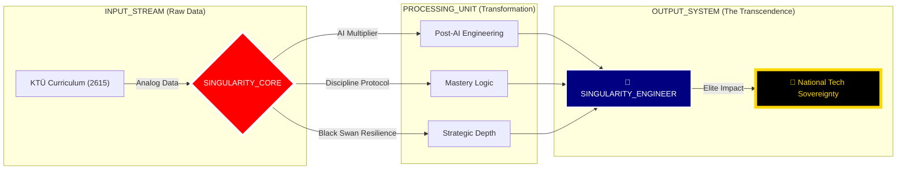

<div align="center">

# 🛰️ KTÜ POST-AI STRATEGIC COMMAND CENTER
## ⛩️ "Transcendental Engineering & Multi-Dimensional Mastery" ⛩️

[](./SUMMARY.md)
[](./ARCHITECTURE.md)
[](./SUMMARY.md)

---

### 🏛️ REPOSITORY DESTINY (DEPO KADERİ)
**Bu arşiv; sıradan bir akademik depo değildir. Bu, liyakatin dijital bir kale (Fortress) haline geldiği, müfredatın bir "Base Layer" olarak aşılıp, yapay zeka ve mühendislik disipliniyle arşa çıkarıldığı bir "Singularity" merkezidir.**

[🛰️ Architecture](./ARCHITECTURE.md) • [📜 Manifesto](./_MANIFESTO/README.md) • [📡 Roadmap](./ROADMAPS/README.md) • [📜 Mastery Log](./MASTER_LOG.md)

---

</div>

## 📡 LIVE SYSTEM TELEMETRY (GERÇEK ZAMANLI VİZYON)



---

## 🏗️ ACADEMIC COMMAND DASHBOARD (SINGULARITY_MODE)

Müfredatı bir "Sistem Hacking" operasyonu gibi yönetiyoruz. Her dönem bir "Sector"dür.

<table width="100%">
  <tr>
    <th width="50%" align="center">🔥 SECTOR 01: IGNITION (1. SINIF)</th>
    <th width="50%" align="center">🛡️ SECTOR 02: FORTIFICATION (2. SINIF)</th>
  </tr>
  <tr>
    <td valign="top">
      <ul>
        <li><b>SEC-01:</b> <a href="./1_SINIF/1_Guz/">Algorithm & Logic Hacking</a> <br/> <sub><i>"Mantıksal temeli AI ile yıkıp yeniden kur."</i></sub></li>
        <li><b>SEC-02:</b> <a href="./1_SINIF/2_Bahar/">System Core Recon</a> <br/> <sub><i>"Donanımın ruhuna (C/ASM) ilk sızma."</i></sub></li>
      </ul>
    </td>
    <td valign="top">
      <ul>
        <li><b>SEC-03:</b> <a href="./2_SINIF/3_Guz/">Data Structure Singularity</a> <br/> <sub><i>"Bellek optimizasyonunun zirvesi."</i></sub></li>
        <li><b>SEC-04:</b> <a href="./2_SINIF/4_Bahar/">Architectural Solidification</a> <br/> <sub><i>"DB & Sistem mimarisinin inşası."</i></sub></li>
      </ul>
    </td>
  </tr>
  <tr>
    <th width="50%" align="center">⚡ SECTOR 03: ASCENSION (3. SINIF)</th>
    <th width="50%" align="center">🌌 SECTOR 04: TRANSCENDENCE (4. SINIF)</th>
  </tr>
  <tr>
    <td valign="top">
      <ul>
        <li><b>SEC-05:</b> <a href="./3_SINIF/5_Guz/">Deep Infra & Network Mastery</a> <br/> <sub><i>"OS & Network katmanlarında hakimiyet."</i></sub></li>
        <li><b>SEC-06:</b> <a href="./3_SINIF/6_Bahar/">Scalable Singularity Arch.</a> <br/> <sub><i>"Dağıtık sistemlerin tanrısı ol."</i></sub></li>
      </ul>
    </td>
    <td valign="top">
      <ul>
        <li><b>SEC-07:</b> <a href="./4_SINIF/7_Guz/">Industrial Quality Quantum</a> <br/> <sub><i>"Kusursuz kalite ve otonom test."</i></sub></li>
        <li><b>SEC-08:</b> <a href="./4_SINIF/8_Bahar/">Final: SINGULARITY_PROJECT</a> <br/> <sub><i>"Zamanın ötesindeki son mühür."</i></sub></li>
      </ul>
    </td>
  </tr>
</table>

---

## 🛣️ MASTERY ROADMAPS (HEDEF YOL HARİTALARI)

| Uzmanlık | Odak | Yol Haritası |
| :--- | :--- | :--- |
| **System Architect** | Mimari & Low-Level | [🔍 Explore Path](./ROADMAPS/SYSTEM_ARCHITECT.md) |
| **AI Solution Engineer** | AI & Data | [🔍 Explore Path](./ROADMAPS/AI_ENGINEER.md) |
| **Cyber Defense Lead** | Savunma & Net | [🔍 Explore Path](./ROADMAPS/CYBER_DEFENSE.md) |

---

## 🛡️ STRATEGIC DOCTRINES (DOKTRİNLER)

> [!CAUTION]
> ### ⚔️ RULE 01: DIPLOMA IS COLLATERAL
> Diploma bir gaye değil, liyakat yolculuğunda toplanan bir ganimettir. Asıl hedef, sistemin ötesindeki **MUTLAK HAKİMİYET**tir.

> [!IMPORTANT]
> ### 🤖 RULE 02: AI SYNERGY
> Yapay zeka senin kölen değil, zihninin 100x genişlemiş halidir. Onu yasaklayan sistemlere inat, biz onu **YARATICI YIKIM** (Creative Destruction) için kullanıyoruz.

---

## 📡 TERMINAL LOGS (MASTER FEED)

```bash
[SYS_BOOT]: KTÜ Post-AI Hub Initialized... [OK]
[LIYAKAT]: Scanning Sector 01-08... Integrity verified.
[AI_SYNC]: Singular AI synergy active. 
[WARNING]: Analog limitations detected in Sector 01-04. Applying Black Swan Protocol.
[DESTINY]: Path to National Tech Sovereignty identified.
```

---

<div align="center">
  
`TRANSMISSION_LEVEL: SINGULARITY`  
`ARCHIVE_LEVEL: GOD_MODE_PLUS`  
`COORDINATES: @BAHATTINYUNUS // STRATEGIC_ASSET`
  
</div>