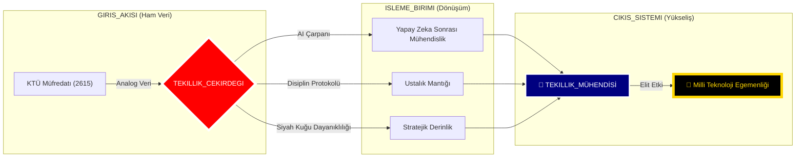

<div align="center">

# 🛰️ KTÜ YAPAY ZEKA SONRASI STRATEJİK KOMUTA MERKEZİ
## ⛩️ "Üstün Mühendislik ve Çok Boyutlu Uzmanlık" ⛩️

[](./4_SISTEM/OZET.md)
[](./1_DOKTRIN/MIMARI_YAPI.md)
[](./4_SISTEM/OZET.md)

---

### 🏛️ DEPO KADERİ (REPOSITORY DESTINY)
**Bu arşiv; sıradan bir akademik depo değildir. Bu, liyakatin dijital bir kale (Fortress) haline geldiği, müfredatın bir "Temel Katman" (Base Layer) olarak aşılıp, yapay zeka ve mühendislik disipliniyle arşa çıkarıldığı bir "Tekillik" (Singularity) merkezidir.**

[🛰️ Mimari](./1_DOKTRIN/MIMARI_YAPI.md) • [📜 Manifesto](./1_DOKTRIN/_MANIFESTO/README.md) • [📡 Yol Haritası](./3_KARIYER/YOL_HARITALARI/README.md) • [📜 Ustalık Logu](./4_SISTEM/ANA_LOG.md)

---

</div>

## 🗺️ STRATEJİK İÇERİK HARİTASI (CONTENT HUB)
**Depo sistemi, 6 stratejik katman üzerine inşa edilmiştir. Her katman, mühendislik yolculuğunuzun farklı bir evresini temsil eder:**

### 📂 [0_MUREDDAAT](./0_MUREDDAAT/) | Ustalık ve Müfredat Katmanı
KTÜ Yazılım Mühendisliği resmi müfredatının liyakatle "hacklenmiş" hali. 4 yıllık yolculuk, 8 stratejik sektöre ayrılmıştır:

#### 🔥 1. SINIF: ATEŞLEME (Algoritma ve Mantık)
- **SEC-01 (Güz):** [Algoritma I](./0_MUREDDAAT/1_SINIF/1_Guz/Algoritma_ve_Programlama_I/Ders_Plani.md) | *Odak:* Pointerlar, Stack Disiplini, C Mantığı.
- **SEC-02 (Bahar):** [Algoritma II](./0_MUREDDAAT/1_SINIF/2_Bahar/Algoritma_ve_Programlama_II/Ders_Plani.md) | *Odak:* Gelişmiş Yapılar, Dosya Sistemleri.
> [!TIP]
> **Rehber:** [Programlama Doktrini](./2_USTALIK/_REHBERLER/PROGRAMLAMA_DOKTRINI.md) temel atarken en büyük yardımcınızdır.

#### 🛡️ 2. SINIF: TAHKİMAT (Veri ve Mimari)
- **SEC-03 (Güz):** [Veri Yapıları](./0_MUREDDAAT/2_SINIF/3_Guz/Veri_Yapilari/Ders_Plani.md) | *Odak:* Heap Yönetimi, Ağaçlar, Big O Optimizasyonu.
- **SEC-04 (Bahar):** [Veritabanı](./0_MUREDDAAT/2_SINIF/4_Bahar/Veritabani_Yonetim_Sistemleri/Ders_Plani.md) | *Odak:* DB Mimarisi, Normalizasyon, SQL Mastery.

#### ⚡ 3. SINIF: YÜKSELİŞ (Sistem ve Ağ)
- **SEC-05 (Güz):** [İşletim Sistemleri](./0_MUREDDAAT/3_SINIF/5_Guz/Isletim_Sistemleri/Ders_Plani.md) | *Odak:* Kernel Modları, Süreç Senkronizasyonu.
- **SEC-06 (Bahar):** [Tasarım ve Mimari](./0_MUREDDAAT/3_SINIF/6_Bahar/Yazilim_Tasarim_ve_Mimarisi/Ders_Plani.md) | *Odak:* SOLID, Design Patterns, Hexagonal Architecture.
> [!IMPORTANT]
> **Rehber:** [Sistem Tasarımı El Kitabı](./2_USTALIK/_REHBERLER/SISTEM_TASARIMI_EL_KITABI.md) bu aşamada ana haritanızdır.

#### 🌌 4. SINIF: ÖTESİ (Kalite ve Tekillik)
- **SEC-07 (Güz):** [Test ve Kalite](./0_MUREDDAAT/4_SINIF/7_Guz/Yazilim_Testi_ve_Kalitesi/Ders_Plani.md) | *Odak:* TDD, Otonom Testler, DevSecOps.
- **SEC-08 (Bahar):** [Bitirme Projesi](./0_MUREDDAAT/4_SINIF/8_Bahar/Bitirme_Calismasi/Ders_Plani.md) | *Odak:* Final Seal, Uçtan Uca Sistem İnşası.

---

### 📂 [1_DOKTRIN](./1_DOKTRIN/) | İnanç ve Disiplin
Liyakatin kanunları. Post-AI çağında nasıl ayakta kalınır ve nasıl hükmedilir?
- [🛰️ Mimari Yapı](./1_DOKTRIN/MIMARI_YAPI.md) | [🤖 AI Çağı Rehberi](./1_DOKTRIN/YAPAY_ZEKA_CAGI_REHBERI.md)
- [🦅 Katkı Rehberi](./1_DOKTRIN/KATKI_REHBERI.md) | [🛠️ Teknoloji Yığını](./1_DOKTRIN/TEKNOLOJI_YIGINI.md)

### 📂 [2_USTALIK](./2_USTALIK/) | Güç Çarpanı
Öğrenmeyi öğrenmek ve derinleşmek. Teoriyi 10x güçlendiren metodolojiler.
- [🧠 Nasıl Çalışmalı?](./2_USTALIK/NASIL_CALISMALI.md) | [🏗️ Proje Rehberi](./2_USTALIK/PROJE_REHBERI.md)
- [📡 Ustalık Notları (80/20)](./2_USTALIK/_USTALIK_NOTLARI/README.md) | [📜 Derin Rehberler](./2_USTALIK/_REHBERLER/)

### 📂 [3_KARIYER](./3_KARIYER/) | Operasyonel Yayılım
Yeteneklerin sektörel etkiye dönüştürülmesi. CV'nin ötesinde bir varlık inşası.
- [📡 Kariyer ve Ağ](./3_KARIYER/KARIYER_VE_AG.md) | [🤝 Mentorluk Sistemi](./3_KARIYER/MENTORLUK_VE_YARDIMLASMA.md)
- [🔍 Kariyer Yol Haritaları](./3_KARIYER/YOL_HARITALARI/README.md)

### 📂 [4_SISTEM](./4_SISTEM/) | Komuta ve Kontrol
Depo yönetim paneli ve stratejik telemetri verileri.
- [📜 Ana Log](./4_SISTEM/ANA_LOG.md) | [🌌 Stratejik Özet](./4_SISTEM/OZET.md)
- [⚔️ Disiplin Cephanesi](./4_SISTEM/KAYNAK_MERKEZI.md) | [🛡️ Protokoller](./4_SISTEM/_PROTOKOLLER/)

### 📂 [5_ARSIV](./5_ARSIV/) | Yan İçerik ve Analiz
Sisteme yönelik eleştiriler ve derinlemesine akademik analizler.
- [🚩 Sistem Eleştirisi](./5_ARSIV/SISTEM_ELESTIRISI.md) | [📝 Medium Makaleleri](./5_ARSIV/medium.md)

---

<div align="center">

## 📡 CANLI SİSTEM TELEMETRİSİ (GERÇEK ZAMANLI VİZYON)



---

## 🛡️ STRATEJİK DOKTRİNLER (DOKTRİNLER)

> [!CAUTION]
> ### ⚔️ KURAL 01: DİPLOMA YAN ÜRÜNDÜR
> Diploma bir gaye değil, liyakat yolculuğunda toplanan bir ganimettir. Asıl hedef, sistemin ötesindeki **MUTLAK HAKİMİYET**tir.

> [!IMPORTANT]
> ### 🤖 KURAL 02: YAPAY ZEKA SİNERJİSİ
> Yapay zeka senin kölen değil, zihninin 100x genişlemiş halidir. Onu yasaklayan sistemlere inat, biz onu **YARATICI YIKIM** (Creative Destruction) için kullanıyoruz.

---

## 📡 TERMİNAL LOGLARI (MASTER FEED)

```bash
[SYS_BOOT]: KTÜ Yapay Zeka Sonrası Merkezi Başlatıldı... [TAMAM]
[STRUCT]: 6 Katmanlı Stratejik Hiyerarşi Aktif.
[LIYAKAT]: Sektör 01-08 Taranıyor... Bütünlük doğrulandı.
[AI_SYNC]: Tekil AI sinerjisi aktif. 
[DESTINY]: Milli Teknoloji Egemenliğine giden yol tanımlandı.
```

---

<div align="center">
  
`İLETİM_SEVİYESİ: TEKİLLİK`  
`ARŞİV_SEVİYESİ: ÜST_MOD_ARTI`  
`KOORDİNATLAR: @BAHATTINYUNUS // STRATEJİK_VARLIK`
  
</div>