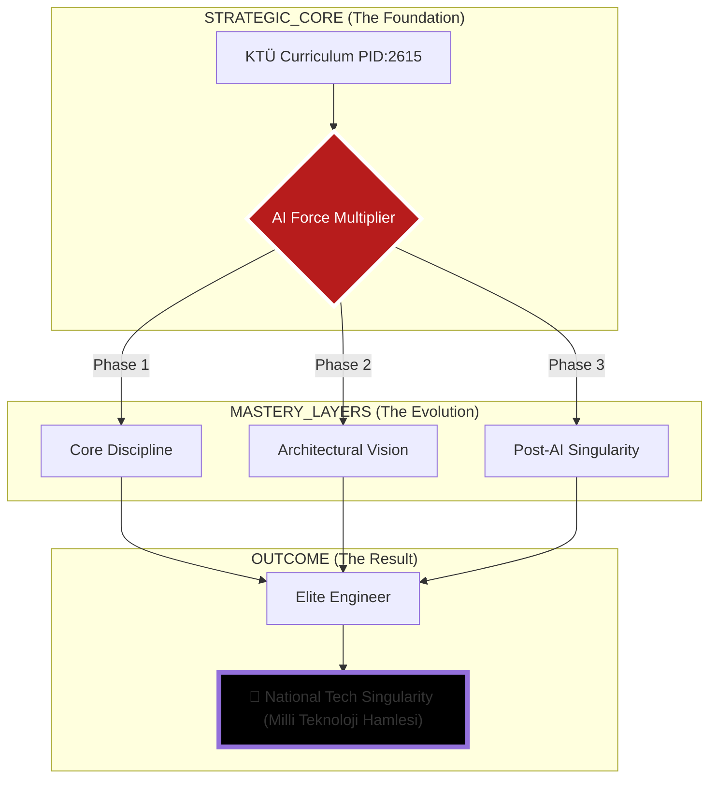

# 🌌 KTÜ POST-AI STRATEGIC COMMAND CENTER
## ⛩️ "Transcendental Engineering & Multi-Dimensional Mastery" ⛩️

---

### 🏛️ REPOSITORY DESTINY (DEPO KADERİ)
**Bu arşiv; sıradan bir akademik depo değildir. Bu, liyakatin dijital bir kale (Fortress) haline geldiği, müfredatın bir "Base Layer" olarak aşılıp, yapay zeka ve mühendislik disipliniyle arşa çıkarıldığı "Transcendental" bir operasyon merkezidir.**

[🛰️ Strategic Architecture](./ARCHITECTURE.md) • [📜 Mastery Manifesto](./_MANIFESTO/README.md) • [📡 Singularity Guide](./AI_ERA_GUIDE.md)

---

## 🛰️ SYSTEM ARCHITECTURE OVERVIEW

---

## 🏗️ ACADEMIC COMMAND DASHBOARD (GOD_MODE)

Müfredatı bir "Sistem Hacking" operasyonu gibi yönetiyoruz.

<table width="100%">
  <tr>
    <th width="50%" align="center">🔥 PHASE 1: IGNITION (1. SINIF)</th>
    <th width="50%" align="center">🛡️ PHASE 2: FORTIFICATION (2. SINIF)</th>
  </tr>
  <tr>
    <td valign="top">
      <ul>
        <li><b>SEC-01:</b> <a href="./1_SINIF/1_Guz/">Algorithm & Logic Hacking</a></li>
        <li><b>SEC-02:</b> <a href="./1_SINIF/2_Bahar/">System Core Reconnaissance</a></li>
      </ul>
    </td>
    <td valign="top">
      <ul>
        <li><b>SEC-03:</b> <a href="./2_SINIF/3_Guz/">Data Structure Optimization</a></li>
        <li><b>SEC-04:</b> <a href="./2_SINIF/4_Bahar/">Architectural Solidification</a></li>
      </ul>
    </td>
  </tr>
  <tr>
    <th width="50%" align="center">⚡ PHASE 3: ASCENSION (3. SINIF)</th>
    <th width="50%" align="center">🌌 PHASE 4: TRANSCENDENCE (4. SINIF)</th>
  </tr>
  <tr>
    <td valign="top">
      <ul>
        <li><b>SEC-05:</b> <a href="./3_SINIF/5_Guz/">Deep Infrastructure Mastery</a></li>
        <li><b>SEC-06:</b> <a href="./3_SINIF/6_Bahar/">Scalable Singularity Arch.</a></li>
      </ul>
    </td>
    <td valign="top">
      <ul>
        <li><b>SEC-07:</b> <a href="./4_SINIF/7_Guz/">Industrial Quality Quantum</a></li>
        <li><b>SEC-08:</b> <a href="./4_SINIF/8_Bahar/">Final: GOD_MODE_PROJECT</a></li>
      </ul>
    </td>
  </tr>
</table>

---

## 🛡️ STRATEGIC DOCTRINES (DOKTRİNLER)

> [!CAUTION]
> ### ⚔️ RULE 01: DIPLOMA IS COLLATERAL
> Diploma bir gaye değil, liyakat yolculuğunda toplanan bir ganimettir. Asıl hedef, sistemin ötesindeki **MUTLAK HAKİMİYET**tir.

> [!IMPORTANT]
> ### 🤖 RULE 02: AI SYNERGY
> Yapay zeka senin kölen değil, zihninin 100x genişlemiş halidir. Onu yasaklayan sistemlere inat, biz onu **YARATICI YIKIM** (Creative Destruction) için kullanıyoruz.

---

## 🌐 QUANTUM FAQS

**S: Bu repo neden bu kadar agresif?**
*C: Çünkü ortalama olmanın bedeli, "sıradanlık çukurunda" kaybolmaktır. Biz zirveyi hedefliyoruz.*

**S: Müfredatın dışındaki bilgiler güvenli mi?**
*C: Gerçek güvenlik liyakattedir. Sektörün en sert projelerine hazır olmak, akademik kağıt parçalarından daha güvenlidir.*

---

  
`TRANSMISSION_STATUS: TRANSCENDENTAL`  
`ARCHIVE_LEVEL: GOD_MODE`  
`COORDINATES: @BAHATTINYUNUS // STRATEGIC_ASSET`
  

