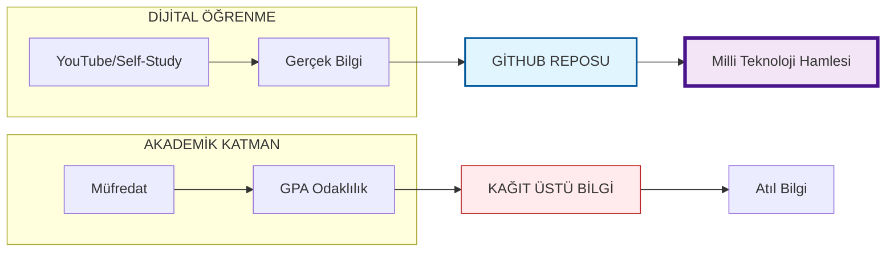

# 🏛️ KTÜ YAZILIM MÜHENDİSLİĞİ AKADEMİK KOMUTA MERKEZİ
### "Liyakat Kağıtta Değil, Repo'dadır" — Meritocratic Academic Archive

---

**Bu arşiv, sadece sınavları geçmek için değil, mühendisliği "geçmek" ve Milli Teknoloji Hamlesi vizyonuna gerçek katkı sağlamak amacıyla oluşturulmuştur.**

[📖 Manifestoyu Oku](./medium.md) • [📁 Akademik Dashboard](#-akademik-dashboard) • [📊 İlerlemeyi Gör](#-akademik-yol-haritası)

---

> [!CAUTION]
> ### ⚠️ Arşiv Notu: Neden Buradayız? (Sistem Eleştirisi)
> Bu depo, akademik başarı illüzyonuna (GPA) karşı, gerçek mühendislik yetkinliğini (Repo) savunan bir başvuru noktasıdır. Bölümü bırakma ve bu arşivi "dondurma" kararımın arkasındaki teknik buglar:
> 1. **Matematik-I Paradoksu:** Dijital öğrenme kaynaklarının (YouTube vb.) akademik otorite tarafından reddedilmesi.
> 2. **Analog Kodlama Dramı:** Veri Yapıları gibi kritik derslerin kağıt üzerinde, yazılımın doğasına aykırı şekilde ölçülmesi.
> 3. **Pre-AI Müfredat:** Sektörün aylık periyotlarla değiştiği çağda, yıllanmış müfredatlara hapsolmayı reddediş.

---

## 🖥️ AKADEMİK DASHBOARD (BEYOND CURRICULUM)

Bu dashboard, KTÜ müfredatını (PID: 2615) sadece birer basamak olarak görür ve üzerine gerçek dünya projelerini inşa etmeyi hedefler.

<table width="100%">
  <tr>
    <th width="50%" align="center">🟦 1. SINIF: TEMELLER (FOUNDATION)</th>
    <th width="50%" align="center">🟩 2. SINIF: DERİNLEŞME (DEEP DIVE)</th>
  </tr>
  <tr>
    <td valign="top">
      <ul>
        <li><b>1. GÜZ:</b> <a href="./1_SINIF/1_Guz/">Keşif & Giriş</a>   <i>Hedef: Algoritmik disiplin.</i></li>
        <li><b>2. BAHAR:</b> <a href="./1_SINIF/2_Bahar/">Algoritmik Evrim</a>   <i>Hedef: C ile donanım kontrolü.</i></li>
      </ul>
    </td>
    <td valign="top">
      <ul>
        <li><b>3. GÜZ:</b> <a href="./2_SINIF/3_Guz/">Veri & Mantık</a>   <i>Hedef: Gerçek veri mimarileri.</i></li>
        <li><b>4. BAHAR:</b> <a href="./2_SINIF/4_Bahar/">Sistem & Veritabanı</a>   <i>Hedef: Ölçeklenebilir sistemler.</i></li>
      </ul>
    </td>
  </tr>
  <tr>
    <th width="50%" align="center">🟨 3. SINIF: UZMANLIK (SPECIALIZATION)</th>
    <th width="50%" align="center">🟥 4. SINIF: MAESTRO (MASTERY)</th>
  </tr>
  <tr>
    <td valign="top">
      <ul>
        <li><b>5. GÜZ:</b> <a href="./3_SINIF/5_Guz/">OS & Network</a></li>
        <li><b>6. BAHAR:</b> <a href="./3_SINIF/6_Bahar/">Yazılım Tasarımı</a></li>
      </ul>
    </td>
    <td valign="top">
      <ul>
        <li><b>7. GÜZ:</b> <a href="./4_SINIF/7_Guz/">Kalite & Yönetim</a></li>
        <li><b>8. BAHAR:</b> <a href="./4_SINIF/8_Bahar/">Final: Mastery Projesi</a></li>
      </ul>
    </td>
  </tr>
</table>

---

## 📊 AKADEMİK YOL HARİTASI & VİZYON

---

## 🏛️ LİYAKAT VE ÖLÇME STANDARTLARI

| Standart | Akademik Beklenti | **Elite Arşiv Hedefi** |
| :--- | :--- | :--- |
| **Kodlama** | Kağıda Yazım (Analog) | **IDE & Git Standartları** |
| **Öğrenme** | Sadece Müfredat (Dar) | **Sınır Tanımayan Self-Study** |
| **Değerlendirme** | 100'e 10 Kuralı (Ezber) | **Proje & Repo Doluluğu** |

---

  
`STATUS: MERIT_SYNCED`  
`VISION: TARGET_LOCKED`  
`AUTHOR: @BAHATTINYUNUS`
  

